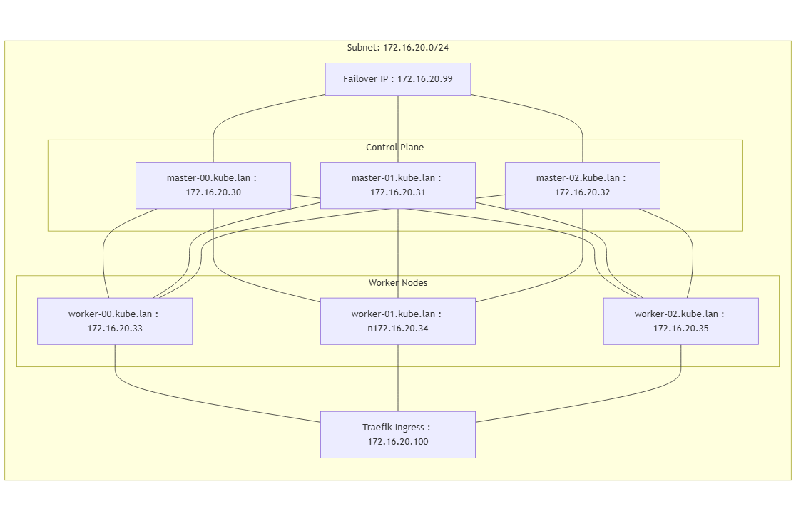

# Mise en place d'un cluster Kubernetes via playbook ANSIBLE

## Architecture



### Dimensionnement

Pour un cluster "Production Ready" :

- 6 VM (4vCPU, 8Go RAM, Stockage 20Go pour du PoC)

Pour un PoC (master - worker) :

- 2 VM (4vCPU, 8Go RAM, Stockage 20Go pour du PoC)

Pour un PoC - ressources faibles :

- 2 VM (2vCPU, 4Go RAM, 20Go pour du PoC)

> Peut être "ric rac" au niveau de la RAM.

### Plan d'addressage

- Il faudra une @IP par nœud.  
- Il faudra une @IP dédiée à la VIP ([IP Failover](https://www.aukfood.fr/ip-failover-avec-hearbeat-et-pacemaker/#:~:text=On%20appelle%20IP%20flottante%20une,parle%20aussi%20d%27IP%20failover.)), qui servira à accéder au control-plan.  
- Il faudra une @IP dédiée à l'[Ingress Traefik](https://kubernetes.io/docs/concepts/services-networking/ingress/), qui permettra de créer des règles (host, vpath) pour exposer des pods vers l'extérieur.  


Faire les exports :

```bash
export K8S_AUTH_KUBECONFIG=/root/.kube/config
```

## Avant exécution  

Il faudra définir dans votre plan réseau une VIP, par exemple dans `172.16.20.0/24`, avec une VIP à `172.16.20.99`, qui permettra d'accéder au control-plan.  

Si le plan d'adressage/et ou la VIP est différents :  

Éditez les fichiers suivants :  

- `roles/keepalived/templates/backup.cfg`  
- `roles/keepalived/templates/master.cfg`  

Au niveau de :  

```txt
    virtual_ipaddress {
        172.16.20.99
    }
```  

Remplacez par votre IP du plan d'adressage.  

Dans le fichier `init-k8s.yaml`  

Au niveau de :  

```yaml
    - name: Initialiser le cluster Kubernetes
      ansible.builtin.command: kubeadm init --control-plane-endpoint "172.16.20.99:6443" --upload-certs --pod-network-cidr=192.168.0.0/16
      when: not kube_cluster.stat.exists
```  

Remplacez `172.16.20.99` par la VIP.  

Pensez à éditer le fichier d'inventaire dans `inventory/inventaire.yaml` pour y renseigner l’@IP de la VM et l'utilisateur.  

## Exécution  

Depuis `bastion-ansible` :  

1. SSH sur chaque VM cible (ajout du fingerprint SSH).  

Pour lancer l'installation de Kubernetes :  

```bash
ansible-playbook -i inventory/inventaire.yaml install-k8s.yml
```  

Pour initialiser le cluster K8s :  

```bash
ansible-playbook -i inventory/inventaire.yaml init-k8s.yaml
```

```bash
ansible-playbook -i inventory/inventaire.yaml install-monitoring.yaml
```

## Vérification  

Il faudra vous connecter sur `master-00` en `root`, puis exécuter :  

```bash
kubectl get nodes
```  

Sortie attendue :  

```txt
master-00   Ready    control-plane   2m29s   v1.29.14
master-01   Ready    control-plane   23s     v1.29.14
master-02   Ready    control-plane   21s     v1.29.14
worker-00   Ready    <none>          71s     v1.29.14
worker-01   Ready    <none>          72s     v1.29.14
worker-02   Ready    <none>          71s     v1.29.14
```  

## Mise en place de l'ingress  

Sélectionnez une @IP de votre plan d'adressage qui sera utilisée pour l'ingress afin d'accéder aux ressources dans Kubernetes.  

Éditez le fichier `init-traefik-ingress.yaml` au niveau de :  

```yaml
    - name: Create an IPPool
      kubernetes.core.k8s:
        state: present
        definition:
          apiVersion: metallb.io/v1beta1
          kind: IPAddressPool
          metadata:
            namespace: metallb-system
            name: ippool
          spec:
            addresses:
            - 172.16.20.100/32
```  

> Remplacez `172.16.20.100` par votre IP d'ingress.
> Ajouter une entrée DNS suivante @IP_INGRESS A monitoring.kube.lan (/etc/hosts)

## Récupérer mot de passe Grafana (depuis master-00)
 
```bash
kubectl get secret --namespace monitoring grafana -o jsonpath="{.data.admin-password}" | base64 --decode ; echo
```
